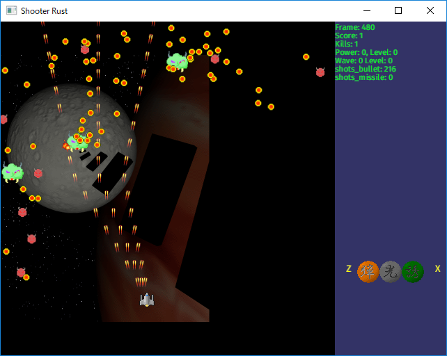

# Shooter-rust

This is an experimental repository to implement Shoot 'em up game in Rust and Piston.

## Screenshots

## Controls

* Arrow keys, W, A, S, D - move
* Z, X - select weapon
* C - shoot weapon
* Space - begin new game
* P - toggle pause
* Esc - exit application

## History

I originally wrote this game in C back in 2007 in order to learn how to program games and real-time program
with Windows API.

However, it has no point to know how to program in Windows API today.
There are many frameworks that you can program cross-platform GUI applications.
You should use one of them and not bound to a specific platform.
On top of that, Windows API is ancient, it smells like walking dead.

So I wanted to port it in Rust to learn and compare how Rust feels in an actual application development.

## Libraries

This application uses [Piston](https://github.com/PistonDevelopers/piston) game engine.
